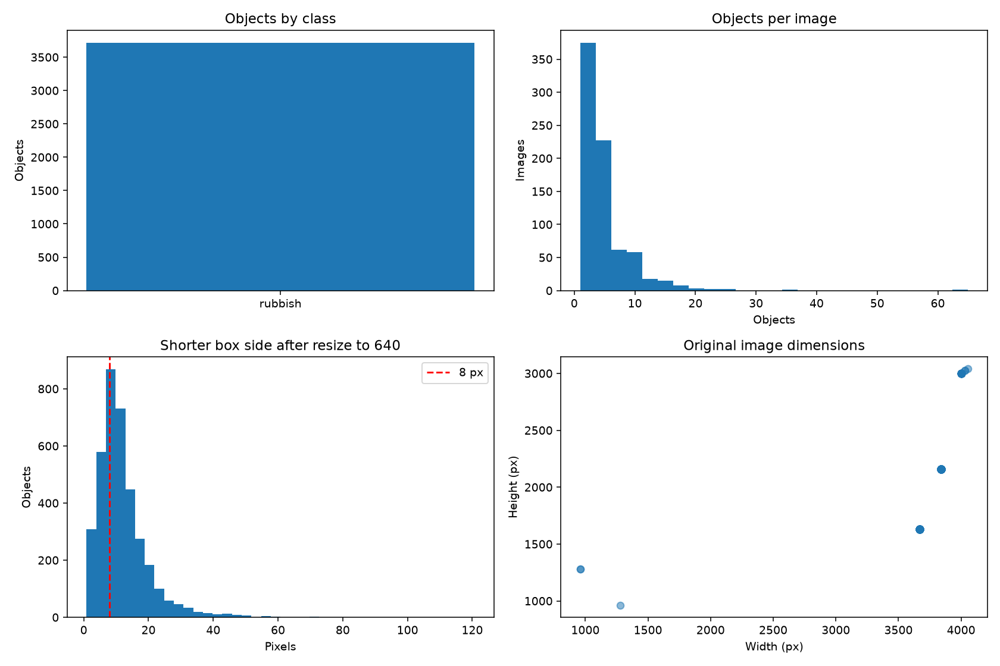
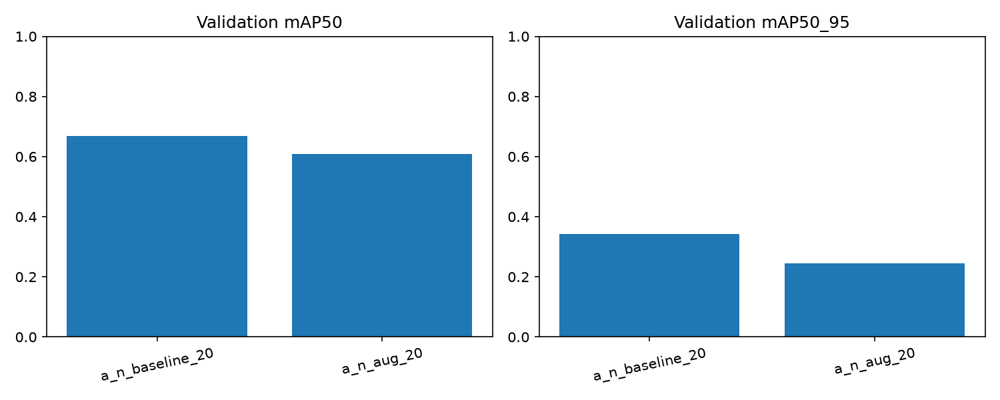
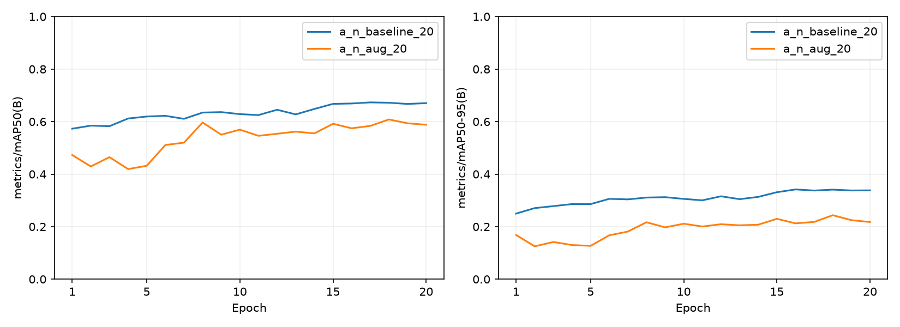
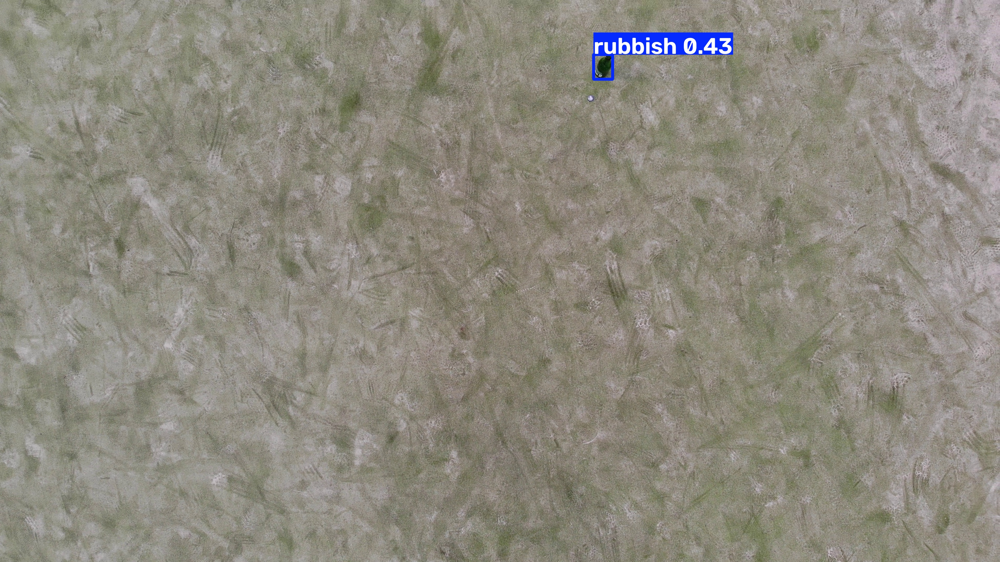

# Результаты части А

Дата выполнения: 4 октября 2026 года. Реализованы загрузка источника, аудит, подготовка разметки YOLO, групповой split, fine-tuning YOLOv8n и сравнение аугментаций. Область текущего эксперимента — видимый мусор в UAVVaste; перенос на морские или спутниковые изображения здесь не измеряется.

## Данные

Источник: [UAVVaste](https://github.com/PUTvision/UAVVaste), [официальный архив](https://doi.org/10.5281/zenodo.8214061). Загружены все 772 изображения и 3718 рамок одного класса `rubbish`. MD5 архива совпал с опубликованным: `1575c32c04bdf944047563e4a1786c2a`. SHA-256 разметки: `2779d40ea98db05d9fb0ea6b0cdbf181a441ce663cf7b81653c81f2f0ef8b403`.

| Часть | Изображения | Объекты |
|---|---:|---:|
| Train | 522 | 2810 |
| Validation | 160 | 583 |
| Test | 90 | 325 |

Split зафиксирован с seed 42. Использованы 17 групп по именам серий; точных дубликатов декодированных RGB-изображений не найдено. Группы не являются подтверждёнными полётами или географическими локациями, поэтому оценки считаются предварительными. Таблица разбиения и сведения об источнике сохранены в [dataset/](dataset/).

Все изображения читаются; некорректных рамок и обрезаний по границам не обнаружено. У 29 изображений присутствует EXIF orientation, у 40 — несколько кадров; эти множества пересекаются. Экспорт сохраняет исходные пиксельные координаты разметки, удаляет поворот из метаданных и явно выбирает первый кадр. В четырёх JPEG потребовалась нормализация конечного маркера: они экспортированы в PNG. Проверка ориентации и рамок выполнена также визуально на примерах.

Во всех изображениях есть размеченный мусор. Отдельных отрицательных сцен нет. После уменьшения длинной стороны кадра до 640 пикселей у 1275 из 3718 объектов короткая сторона меньше 8 пикселей. Это диагностический порог, а не определение small objects в COCO. Основные эксперименты используют целые кадры; режим нарезки реализован и проверен тестами, но его влияние на качество в этом сравнении не измеряется.

## Протокол обучения

Оба запуска используют одни исходные веса YOLOv8n, одинаковые train/validation, seed 42, 20 эпох, размер 640, batch 4, AdamW и начальный learning rate 0,001. E1 использует базовую политику аугментаций. E2 добавляет повороты до ±180° и вертикальное отражение с вероятностью 0,5. Другие настройки совпадают. Это сравнение двух политик; индивидуальный вклад поворота и отражения отдельно не измеряется.

Обучение выполняется на NVIDIA GeForce GTX 1650, 4 ГБ VRAM; Python 3.13.9, PyTorch 2.6.0+cu124, Ultralytics 8.3.228. AMP отключён для этой видеокарты. Уменьшенные входные изображения кэшируются в RAM. Точные версии находятся в [requirements-lock.txt](../../requirements-lock.txt); настройки и сведения о выполнении сохраняются вместе с каждой моделью.

Лучший checkpoint выбирает Ultralytics по validation. Test не передаётся в runner обучения и остаётся для участника Б. Предварительные прогоны на 43/50 изображениях проверяли интеграцию; их метрики не включаются в основное сравнение.

## Измерения

Оба запуска завершили 20 эпох. Таблица содержит метрики сохранённых `best.pt` на **validation**, а не на test. Проверены совпадение манифеста и YAML данных, исходных весов, seed, режима обучения и фактического AMP.

| Эксперимент | Precision | Recall | mAP50 | mAP50–95 |
|---|---:|---:|---:|---:|
| E1: базовое дообучение | 0,6913 | 0,6621 | **0,6690** | **0,3417** |
| E2: повороты и вертикальные отражения | 0,6860 | 0,5922 | 0,6081 | 0,2437 |

При этом бюджете и разбиении базовая политика дала более высокий mAP50–95: разница составляет 0,0980. Для первоначального подключения к приложению выбран `models/a/a_n_baseline_20/best.pt`. Другу передаются оба варианта для общей итоговой оценки.

Результат показывает, что проверенная усиленная политика аугментаций здесь не дала улучшения. Вывод ограничен одним seed, этим набором и 20 эпохами; для более общего вывода нужны повторные эксперименты. Повороты и отражения менялись вместе, поэтому вклад каждого преобразования отдельно не установлен. Наличие обычных фотографий наряду со съёмкой сверху также нужно учитывать при выборе аугментаций.

Точные значения: [comparison.csv](experiments/comparison.csv), [comparison.json](experiments/comparison.json). Исходные таблицы эпох и метаданные сохранены в [E1](experiments/a_n_baseline_20/) и [E2](experiments/a_n_aug_20/). В поле времени второго запуска есть длительный разрыв; эти времена не используются для сравнения быстродействия. Скорость inference оценивается отдельно участником Б.

Пример ниже получен базовой моделью на первом validation-кадре группы `batch_05`. Порог 0,25 используется только для показа рамок; эта иллюстрация не является самостоятельной оценкой качества или установленным рабочим порогом. Precision/Recall в таблице получены валидатором Ultralytics.

## Проверка реализации

25 автоматических тестов прошли: координаты и нарезка, границы split и дубликаты, ошибки данных, EXIF и JPEG, загрузка и возобновление архива, конфигурации и передача весов, сопоставимость экспериментов. Оба ноутбука выполнены и сохранены с результатами. Нативная Ultralytics корректно разрешает все пути `data.yaml` при запуске из другой рабочей папки. Оба финальных checkpoint повторно загружены на CPU; проверены SHA-256, имена классов и настоящее предсказание на validation-изображении.

Ограничения: один класс, отсутствие чистых отрицательных сцен, непроверенные географические границы групп, один seed. Качество на побережье, над водой и на спутниковых изображениях требует отдельного размеченного набора. Типы материалов, нефть и химический состав загрязнения не оценивались.

Порядок передачи результата другу: [HANDOFF.md](HANDOFF.md). План объяснения своей работы: [DEFENSE.md](DEFENSE.md).
