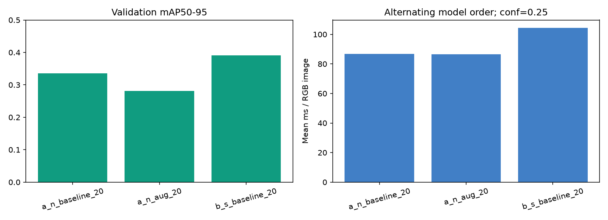
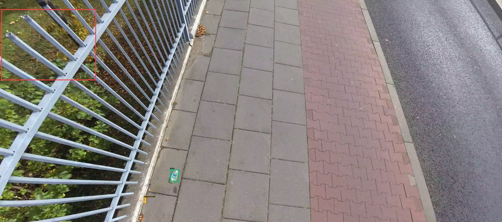
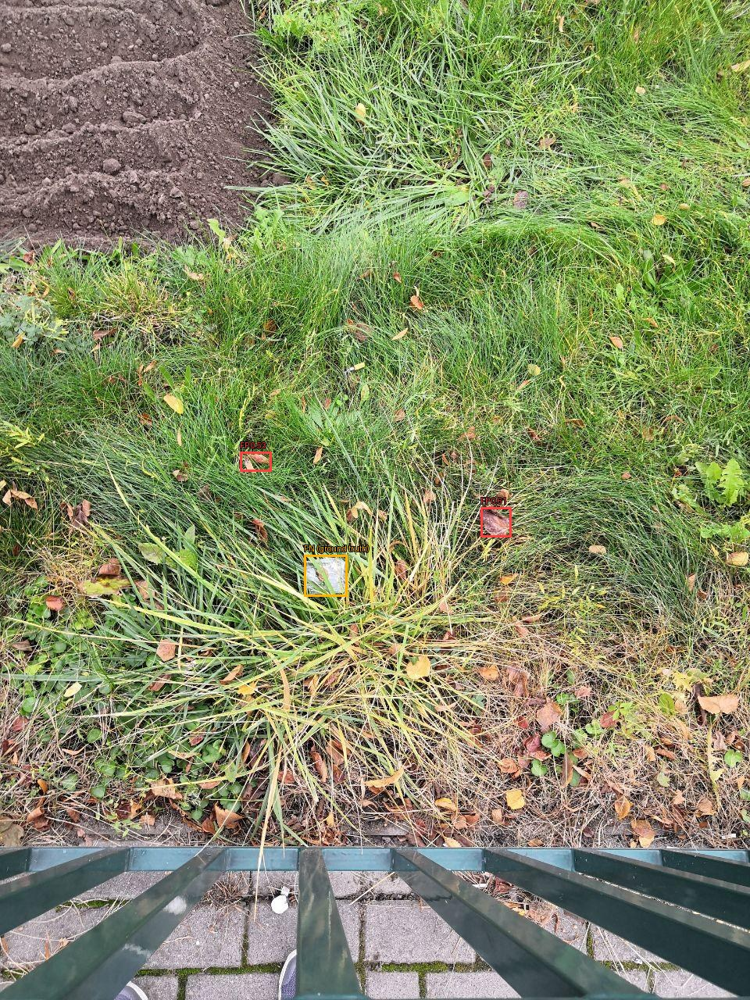

# Часть Б — результаты

Эксперимент выполнен 5 октября 2026 года.

**YOLOv8s дала прирост validation mAP50–95 на 5.54 процентного пункта** относительно базовой YOLOv8n. Для приложения выбрана `b_s_baseline_20`, порог **0.40**. Полная обработка подготовленного RGB-кадра в дополнительном замере заняла в среднем 104.5 мс против 86.7 мс у базовой YOLOv8n (изменение +20.6%).

## Что выполнено

Восстановлены 772 изображения и исходное разбиение А, проверены SHA-256 обеих переданных моделей. YOLOv8s обучена 20 эпох на RTX 3050 Laptop 4 ГБ с параметрами baseline А: imgsz=640, batch=4, seed=42, AdamW, AMP=false, та же аугментация. Обучение заняло около 10 минут. Настройки, логи и история обучения сохранены в [experiments/b_s_baseline_20](experiments/b_s_baseline_20/).

Реализованы inference, CLI, единая оценка, подбор порога на validation, фиксация решения перед test, анализ ошибок, Streamlit и два выполненных ноутбука. Часть А интегрирована в ту же ветку; общий модуль обучения сохраняет результаты Б отдельно.

## Сравнение на validation

160 изображений / 583 объекта. Значения ниже пересчитаны в едином протоколе: square 640, batch=1, FP32, NMS IoU=0.7, AP conf=0.001. Они могут отличаться от исходного отчёта А с настройками validation внутри обучения.

| Модель | Precision¹ | Recall¹ | mAP50 | mAP50–95 | Рабочий порог | F1² |
|---|---:|---:|---:|---:|---:|---:|
| a_n_baseline_20 | 0.6876 | 0.6432 | 0.6678 | 0.3359 | 0.30 | 0.6696 |
| a_n_aug_20 | 0.7000 | 0.5923 | 0.6351 | 0.2809 | 0.30 | 0.6528 |
| b_s_baseline_20 | 0.7833 | 0.6535 | 0.7226 | 0.3913 | 0.40 | 0.7125 |

¹ P/R Ultralytics относятся к её собственной точке максимального F1. ² F1 рабочего порога: отдельное сопоставление рамок по классу и IoU≥0.5, по убыванию уверенности, один к одному. Порог выбирался по максимуму micro F1 только на validation.

Модель выбрана по максимальному mAP50–95; больший размер сети дал улучшение в этом запуске. Аугментированная YOLOv8n уступила baseline. Это один seed и один split, поэтому статистическая значимость преимущества не установлена.

## Скорость

Устройство: **NVIDIA GeForce RTX 3050 Laptop GPU**, PyTorch 2.6.0+cu124, FP32, 640×640, batch=1, общий conf=0.25. 20 одинаковых validation-фото × 3 повтора, 3 прогрева на модель. Входные разрешения перечислены в подробном validation-отчёте. GPU синхронизирован; порядок моделей на каждом кадре перемешан с seed=42. В памяти хранится один декодированный RGB-снимок за раз.

| Модель | Вся функция, mean мс | median мс | p95 мс | Нейросеть, mean мс | median мс |
|---|---:|---:|---:|---:|---:|
| a_n_baseline_20 | 86.7 | 90.0 | 107.8 | 14.4 | 10.1 |
| a_n_aug_20 | 86.4 | 89.8 | 108.5 | 14.1 | 9.5 |
| b_s_baseline_20 | 104.5 | 104.8 | 141.9 | 32.1 | 13.8 |

Вся функция включает копирование/нормализацию RGB в API, preprocessing, нейросеть, NMS и получение рамок на CPU. Чтение файла, загрузка модели, рисование и сохранение исключены. Время нейросети отдельно взято из `Results.speed`. У больших исходных фотографий накладные расходы заметны. Есть разброс задержек ноутбука; это измерение этой машины, не универсальный FPS модели.

[latency.json](latency.json) содержит все измерения. Первичный последовательный замер внутри [validation/REPORT.md](validation/REPORT.md) дал другую картину wall-time; поэтому выше используется дополнительный прогон с чередованием моделей и меньшим потреблением RAM. Исходный протокол и числа сохранены, решение по качеству не менялось.

## Итоговый test

90 изображений / 325 объектов. Проверялась только выбранная модель, с заранее зафиксированным порогом; поиск по test не выполнялся.

| Precision¹ | Recall¹ | mAP50 | mAP50–95 |
|---:|---:|---:|---:|
| 0.8293 | 0.6769 | 0.7968 | 0.4496 |

При рабочем пороге 0.40: **TP=216, FP=38, FN=109**, Precision=0.8504, Recall=0.6646, F1=0.7461.

Test оказался легче по этим метрикам, чем validation; это не основание перенастраивать модель. Подробности: [test/REPORT.md](test/REPORT.md), [зафиксированное решение](validation/selection.json). Первый технический запуск остановился из-за Windows-доступа к служебному кэшу до расчёта метрик; повтор выполнен с теми же настройками.

## Ошибки на validation

У выбранной модели при фиксированном пороге:

| Короткая сторона объекта после resize к 640 | Найдено / всего | Recall |
|---|---:|---:|
| < 8 px | 71 / 159 | 0.447 |
| 8–16 px | 228 / 300 | 0.760 |
| ≥ 16 px | 90 / 124 | 0.726 |

Очень мелкие объекты пропускаются чаще. Среди FP: 82 рамки почти не пересекаются с разметкой (IoU<0.1), 33 пересекаются недостаточно для зачёта, ещё 5 относятся к дубликатам/конфликтам сопоставления. Это геометрические группы, не доказанные причины. Неточная локализация одного объекта может одновременно дать FP и FN.

### Правильное обнаружение

Источник: `images/val/image_00000096.jpg`. Зелёный — TP, красный — FP, жёлтый — рамка пропущенного объекта. Один кадр может содержать разные ошибки.

### Пропуск

Источник: `images/val/image_00000098.jpg`. Зелёный — TP, красный — FP, жёлтый — рамка пропущенного объекта. Один кадр может содержать разные ошибки.

### Ложное обнаружение по IoU-критерию

Источник: `images/val/image_00000115.jpg`. Зелёный — TP, красный — FP, жёлтый — рамка пропущенного объекта. Один кадр может содержать разные ошибки.

Полные таблицы и дополнительные кадры: [validation/REPORT.md](validation/REPORT.md), [error_breakdown.json](validation/error_breakdown.json), [ноутбук ошибок](../../notebooks/b/02_error_analysis.ipynb).

## Проверка и передача

52 автоматических теста прошли. Проверены реальный inference на GPU, сценарий Streamlit на CPU с настоящим снимком и весами, сброс старого результата при смене порога и HTTP health сервера. Проверка интерфейса выполнена через Streamlit AppTest; браузерная проверка не выполнялась. [Протокол](app_check.json).

Локальный архив для передачи: `models/b/participant_b_handoff.zip`, рядом SHA-256. Веса и датасет остаются вне Git. [Инструкция запуска и воспроизведения](README.md).

## Ограничения

Группы заданы по именам файлов, независимость полётов и мест не подтверждена. Нет отдельного набора чистых сцен. Результаты не подтверждают качество на морских, прибрежных или спутниковых снимках. Тип материала, площадь загрязнения и уникальное число предметов по видео не определяются. Для дальнейшего улучшения стоит исследовать мелкие объекты и независимые локации в новом эксперименте; текущий test нельзя использовать для подбора настроек.
