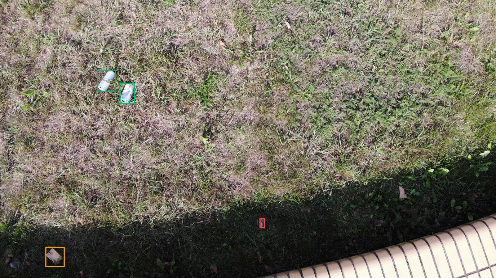
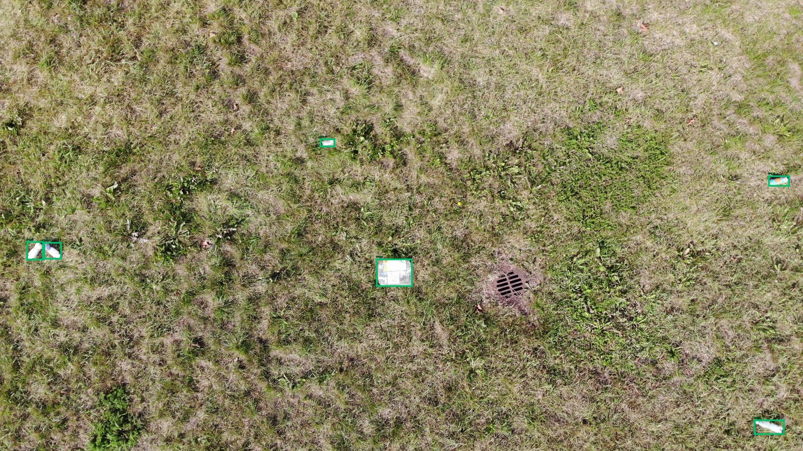
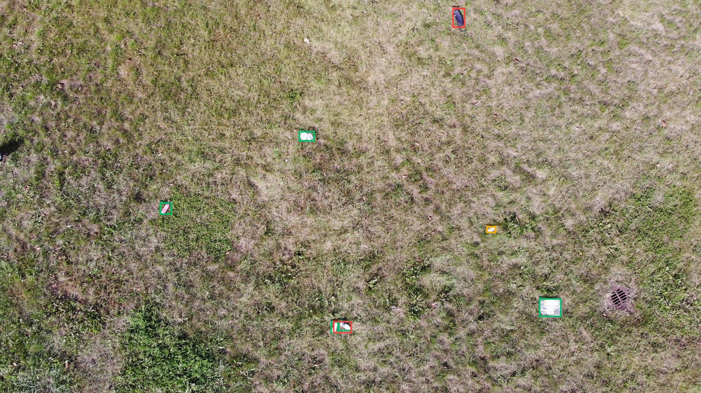
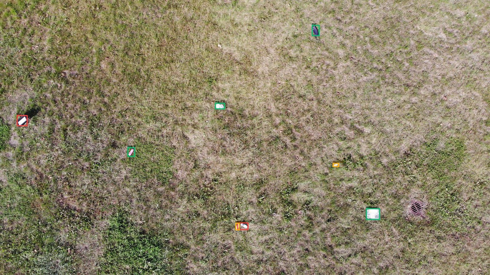
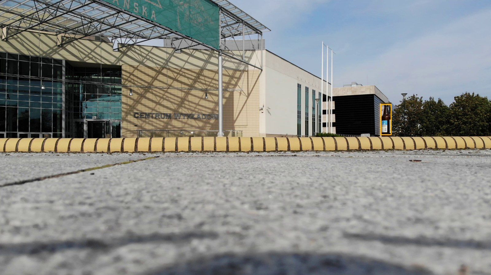

# Оценка: test

Устройство: NVIDIA GeForce RTX 3050 Laptop GPU; imgsz=640; batch=1; FP32.

| Модель | Precision¹ | Recall¹ | mAP50 | mAP50–95 | Порог | F1² | Среднее, мс | p95, мс |
|---|---:|---:|---:|---:|---:|---:|---:|---:|
| b_s_baseline_20 | 0.8293 | 0.6769 | 0.7968 | 0.4496 | 0.40 | 0.7461 | 133.93 | 161.88 |

¹ Precision/Recall Ultralytics при её внутренней оптимальной точке кривой. AP считается с conf=0.001.
² Рабочий порог выбирается только на validation по максимальному micro F1 при IoU=0.5; при равенстве — Precision, затем больший порог.

Время: одинаковый conf=0.25 для всех моделей; копирование RGB, preprocessing, inference, NMS и перенос рамок на CPU после прогрева; без чтения файла, рисования и загрузки весов. GPU синхронизирован.

## Рабочая точка

| Модель | TP | FP | FN | Precision | Recall |
|---|---:|---:|---:|---:|---:|
| b_s_baseline_20 | 216 | 38 | 109 | 0.8504 | 0.6646 |

## Примеры ошибок

Зелёный — TP, красный — FP, жёлтый — FN (рамка разметки). Один кадр может содержать несколько видов ошибок.

### b_s_baseline_20

## Ограничения

Серии определены по именам файлов; независимость полётов/локаций не подтверждена. Один seed. Нет отдельных чистых сцен. Результаты не подтверждают качество на море, побережье или спутниковых снимках.

Модель и порог взяты из зафиксированного решения validation; на test настройки не подбирались.
