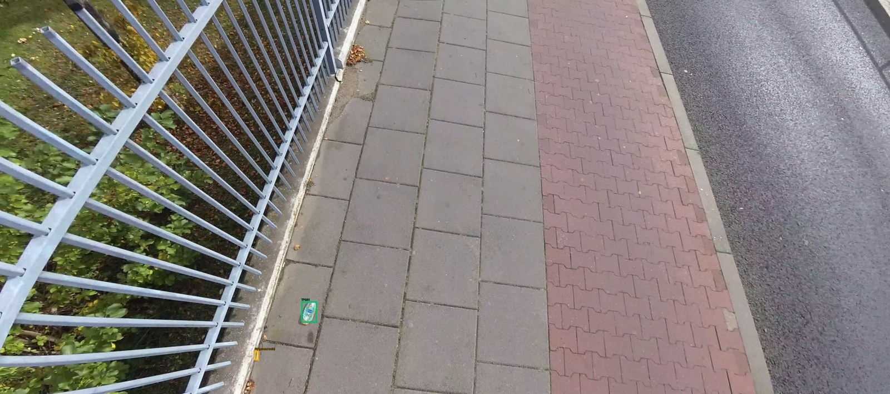
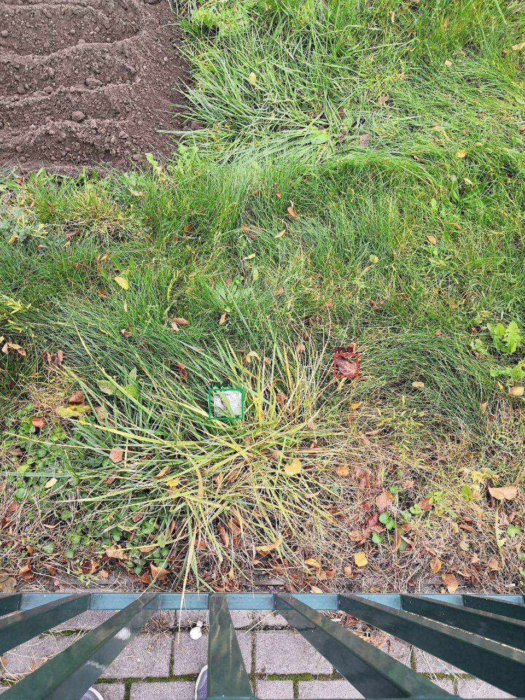
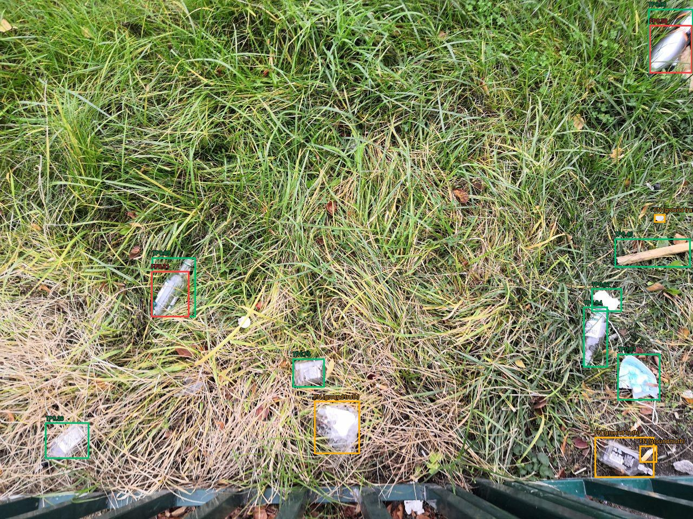
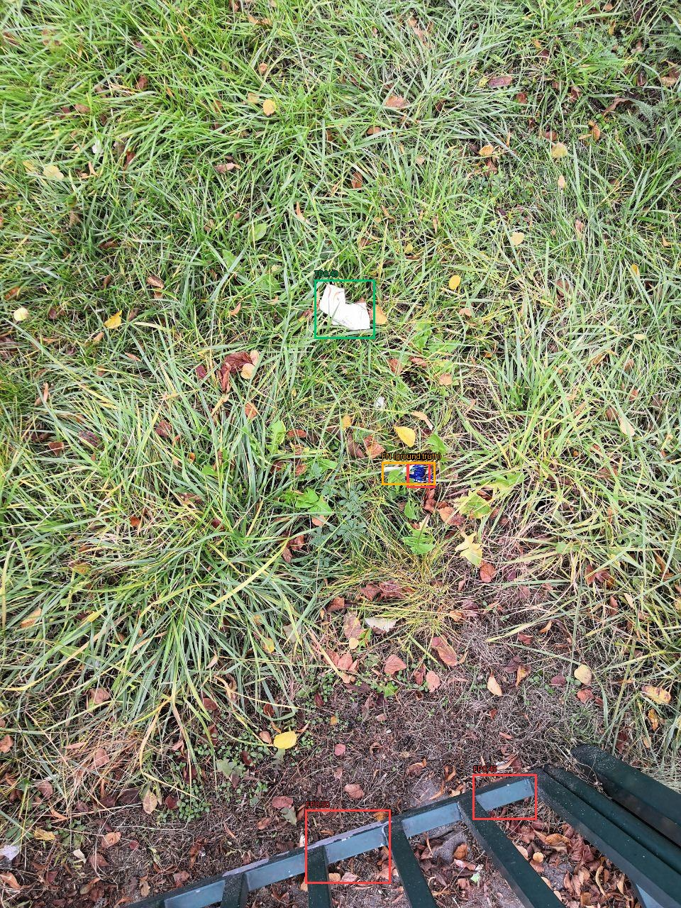
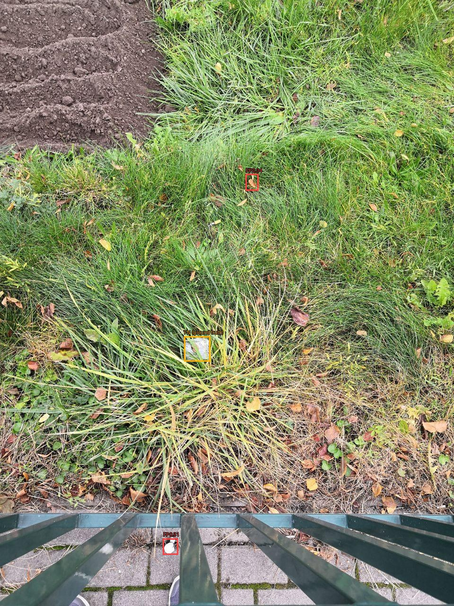
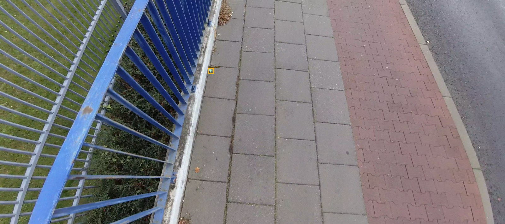
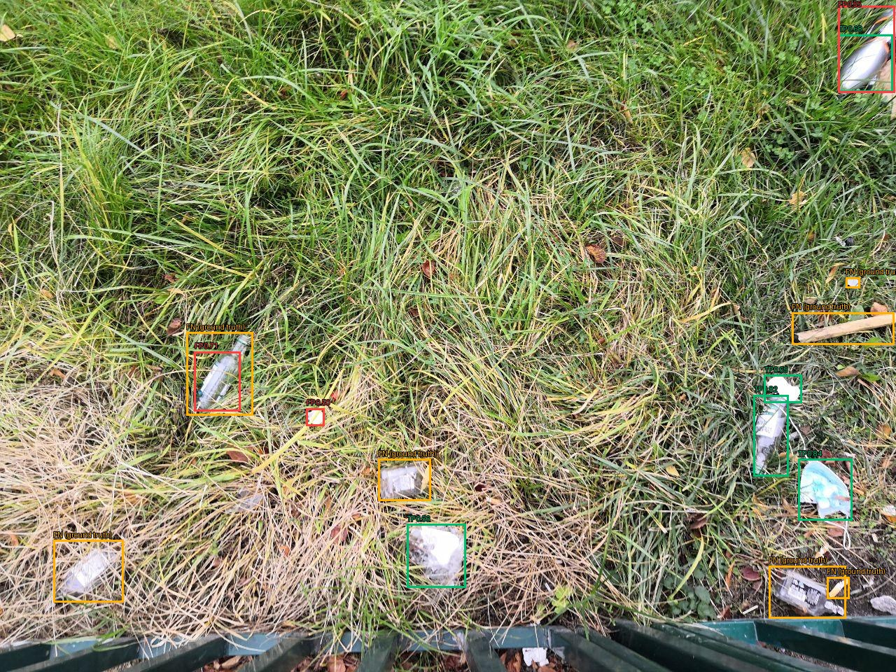

# Оценка: val

Устройство: NVIDIA GeForce RTX 3050 Laptop GPU; imgsz=640; batch=1; FP32.

| Модель | Precision¹ | Recall¹ | mAP50 | mAP50–95 | Порог | F1² | Среднее, мс | p95, мс |
|---|---:|---:|---:|---:|---:|---:|---:|---:|
| a_n_baseline_20 | 0.6876 | 0.6432 | 0.6678 | 0.3359 | 0.30 | 0.6696 | 107.75 | 135.50 |
| a_n_aug_20 | 0.7000 | 0.5923 | 0.6351 | 0.2809 | 0.30 | 0.6528 | 103.71 | 149.00 |
| b_s_baseline_20 | 0.7833 | 0.6535 | 0.7226 | 0.3913 | 0.40 | 0.7125 | 95.68 | 132.09 |

¹ Precision/Recall Ultralytics при её внутренней оптимальной точке кривой. AP считается с conf=0.001.
² Рабочий порог выбирается только на validation по максимальному micro F1 при IoU=0.5; при равенстве — Precision, затем больший порог.

Время: одинаковый conf=0.25 для всех моделей; копирование RGB, preprocessing, inference, NMS и перенос рамок на CPU после прогрева; без чтения файла, рисования и загрузки весов. GPU синхронизирован.

## Рабочая точка

| Модель | TP | FP | FN | Precision | Recall |
|---|---:|---:|---:|---:|---:|
| a_n_baseline_20 | 375 | 162 | 208 | 0.6983 | 0.6432 |
| a_n_aug_20 | 345 | 129 | 238 | 0.7278 | 0.5918 |
| b_s_baseline_20 | 389 | 120 | 194 | 0.7642 | 0.6672 |

## Примеры ошибок

Зелёный — TP, красный — FP, жёлтый — FN (рамка разметки). Один кадр может содержать несколько видов ошибок.

### a_n_baseline_20

### a_n_aug_20

### b_s_baseline_20

## Ограничения

Серии определены по именам файлов; независимость полётов/локаций не подтверждена. Один seed. Нет отдельных чистых сцен. Результаты не подтверждают качество на море, побережье или спутниковых снимках.

Выбрана **b_s_baseline_20** по максимальному validation mAP50–95. Настройки зафиксированы в `selection.json`. Test в этом запуске не использовался.
