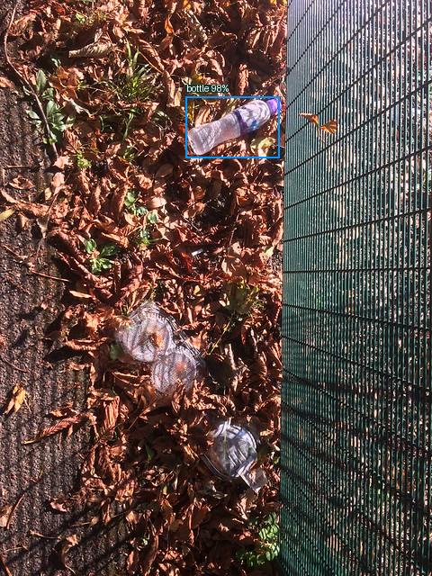
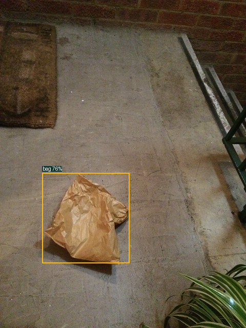
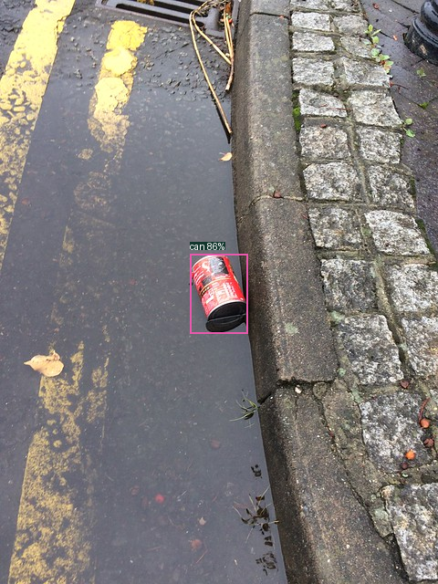

# Распознавание типов мусора — результат

Модель YOLOv8n различает три типа предметов: **бутылка, пакет, банка**. Для каждого предмета возвращаются рамка, тип и уверенность.

Обучение: 30 эпох, 640×640, batch=4, seed=42, AdamW, FP32. Веса: `models/b/taco_n_types_30/best.pt`.

## Данные

Источник — [TACO](https://github.com/pedropro/TACO), официальная проверенная разметка. Это отдельный эксперимент, исходный UAVVaste не получает выдуманные метки типов.

| Часть | Фото | Размеченные предметы | Фото без целевых предметов |
|---|---:|---:|---:|
| train | 450 | 519 | 110 |
| val | 181 | 263 | 30 |
| test | 49 | 52 | 10 |

Категории объединены по исходным меткам TACO: пластиковые/стеклянные бутылки → bottle; бумажные/мусорные/обычные пакеты → bag; пищевые/аэрозольные/напиточные банки → can. Крышки, плёнка и обёртки не считаются пакетами.

## Validation и итоговый test

| Набор | mAP50 | mAP50–95 | Рабочий Precision | Рабочий Recall | Рабочий F1 |
|---|---:|---:|---:|---:|---:|
| validation | 0.3645 | 0.2617 | 0.6012 | 0.3840 | 0.4687 |
| test | 0.4337 | 0.3311 | 0.5278 | 0.3654 | 0.4318 |

Рабочий порог **0.40** выбран на validation по micro F1 и зафиксирован до test. AP вычисляется отдельно с conf=0.001.

## Test по классам

| Класс | mAP50 | mAP50–95 | Рабочий Precision | Рабочий Recall | F1 | TP | FP | FN |
|---|---:|---:|---:|---:|---:|---:|---:|---:|
| Бутылка | 0.4936 | 0.3517 | 0.5294 | 0.4286 | 0.4737 | 9 | 8 | 12 |
| Пакет | 0.3470 | 0.3141 | 0.3333 | 0.2500 | 0.2857 | 2 | 4 | 6 |
| Банка | 0.4604 | 0.3275 | 0.6154 | 0.3478 | 0.4444 | 8 | 5 | 15 |

## Примеры

Примеры выбраны после итоговой проверки для демонстрации; все TP/FP/FN сохраняются в полном test-отчёте.

### Бутылка

Вход: `demo/bottle-input.png`; статус: `correct_detection`.

### Пакет

Вход: `demo/bag-input.png`; статус: `correct_detection`.

### Банка

Вход: `demo/can-input.png`; статус: `correct_detection`.

## Ограничения

Остальные типы мусора модель не классифицирует. Фоновые примеры могут содержать другой мусор и не означают чистую сцену. Пакетов меньше, чем бутылок; метрики нужно смотреть отдельно по классам.

Исходные batch-группы TACO сохраняются целиком в одном split, но независимость мест/авторов не подтверждена. Это один seed. Качество на морских, спутниковых и дроновых фото отдельно не измерено; численные результаты относятся к TACO.

Сравнивать эти числа напрямую с таблицей UAVVaste нельзя: изменились датасет и классы.

Запуск и повторение: [README.md](README.md). Подробные метрики: [validation/REPORT.md](validation/REPORT.md), [test/REPORT.md](test/REPORT.md).
