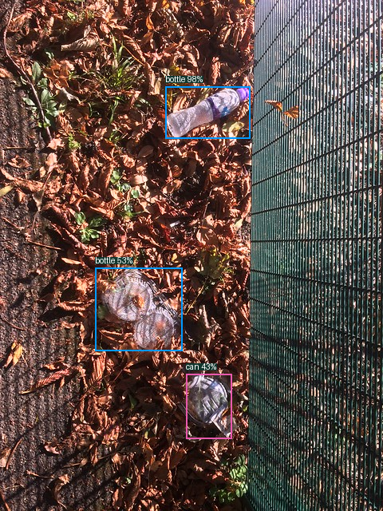
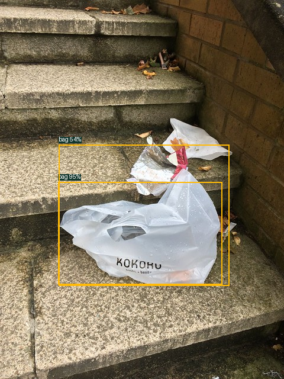
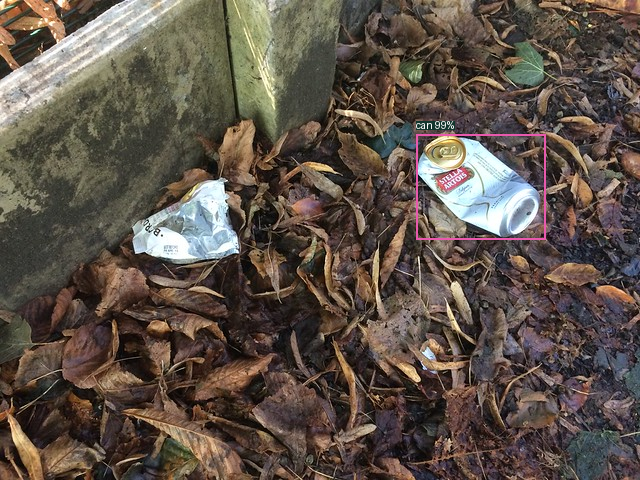

# Распознавание типов мусора — результат

Модель YOLOv8n различает три типа предметов: **бутылка, пакет, банка**. Для каждого предмета возвращаются рамка, тип и уверенность.

Обучение в этом запуске: 50 эпох, 640×640, batch=4, seed=42, AdamW, FP32. Веса: `models/b/taco_n_types_finetune_50/best.pt`.

## Данные

Источник — [TACO](https://github.com/pedropro/TACO), официальная проверенная разметка. Это отдельный эксперимент, исходный UAVVaste не получает выдуманные метки типов.

| Часть | Фото | Размеченные предметы | Фото без целевых предметов |
|---|---:|---:|---:|
| train | 450 | 519 | 110 |
| val | 181 | 263 | 30 |
| test | 49 | 52 | 10 |

Категории объединены по исходным меткам TACO: пластиковые/стеклянные бутылки → bottle; бумажные/мусорные/обычные пакеты → bag; пищевые/аэрозольные/напиточные банки → can. Крышки, плёнка и обёртки не считаются пакетами.

## Validation и итоговый test

| Набор | mAP50 | mAP50–95 | Рабочий Precision | Рабочий Recall | Рабочий F1 |
|---|---:|---:|---:|---:|---:|
| validation | 0.3909 | 0.2888 | 0.5616 | 0.4335 | 0.4893 |
| test | 0.4592 | 0.3552 | 0.4727 | 0.5000 | 0.4860 |

## Сравнение до и после на validation

| Модель | mAP50 | mAP50–95 | Рабочий Recall | Рабочий F1 | Порог |
|---|---:|---:|---:|---:|---:|
| taco_n_types_30 | 0.3645 | 0.2617 | 0.3840 | 0.4687 | 0.40 |
| taco_n_types_finetune_50 | 0.3909 | 0.2888 | 0.4335 | 0.4893 | 0.35 |
| taco_n_types_finetune_careful_30 | 0.3790 | 0.2861 | 0.4068 | 0.4853 | 0.40 |

Выбрана **taco_n_types_finetune_50** по максимальному validation mAP50–95. Для каждой модели её порог выбран на validation по micro F1.

Дообучение началось из `models/b/taco_n_types_30/best.pt` с lr0=0.0002. Оптимизатор и расписание обучения созданы заново; новые размеченные морские снимки не добавлялись.

Рабочий порог **0.35** выбран на validation по micro F1 и зафиксирован до test. AP вычисляется отдельно с conf=0.001.

## Test по классам

| Класс | mAP50 | mAP50–95 | Рабочий Precision | Рабочий Recall | F1 | TP | FP | FN |
|---|---:|---:|---:|---:|---:|---:|---:|---:|
| Бутылка | 0.4955 | 0.3623 | 0.4643 | 0.6190 | 0.5306 | 13 | 15 | 8 |
| Пакет | 0.3791 | 0.3224 | 0.3000 | 0.3750 | 0.3333 | 3 | 7 | 5 |
| Банка | 0.5031 | 0.3809 | 0.5882 | 0.4348 | 0.5000 | 10 | 7 | 13 |

## Примеры

Примеры выбраны после итоговой проверки для демонстрации; все TP/FP/FN сохраняются в полном test-отчёте.

### Бутылка

Вход: `demo/bottle-input.png`; статус: `correct_detection`.

### Пакет

Вход: `demo/bag-input.png`; статус: `correct_detection`.

### Банка

Вход: `demo/can-input.png`; статус: `correct_detection`.

## Ограничения

Остальные типы мусора модель не классифицирует. Фоновые примеры могут содержать другой мусор и не означают чистую сцену. Пакетов меньше, чем бутылок; метрики нужно смотреть отдельно по классам.

Исходные batch-группы TACO сохраняются целиком в одном split, но независимость мест/авторов не подтверждена. Это один seed. Качество на морских, спутниковых и дроновых фото отдельно не измерено; численные результаты относятся к TACO.

Сравнивать эти числа напрямую с таблицей UAVVaste нельзя: изменились датасет и классы.

Запуск и повторение: [README.md](README.md). Подробные метрики: [validation/REPORT.md](validation/REPORT.md), [test/REPORT.md](test/REPORT.md). История эпох всех сравниваемых моделей сохранена в `training/<имя>/results.csv`.

Test TACO уже оценивался в первом эксперименте. Здесь это повторная проверка на том же наборе, а не новый независимый test. В этом запуске модель и порог зафиксированы на validation до повторной проверки test.
