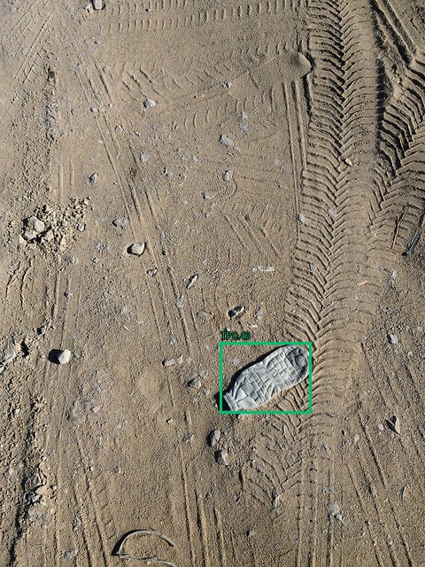
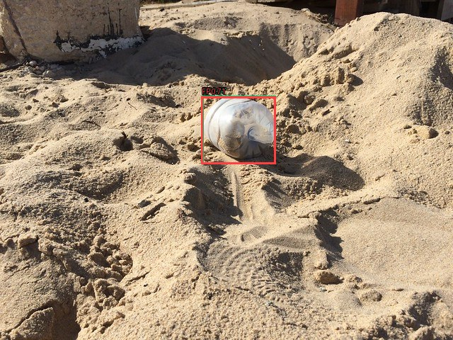
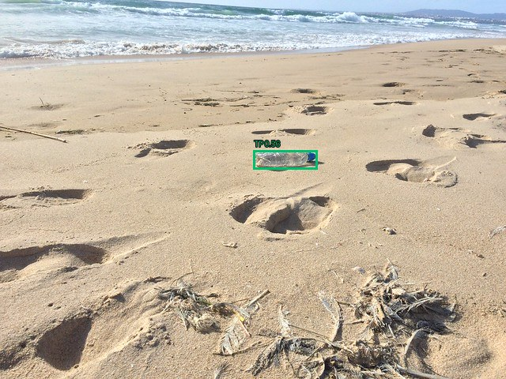
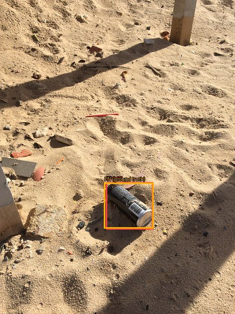
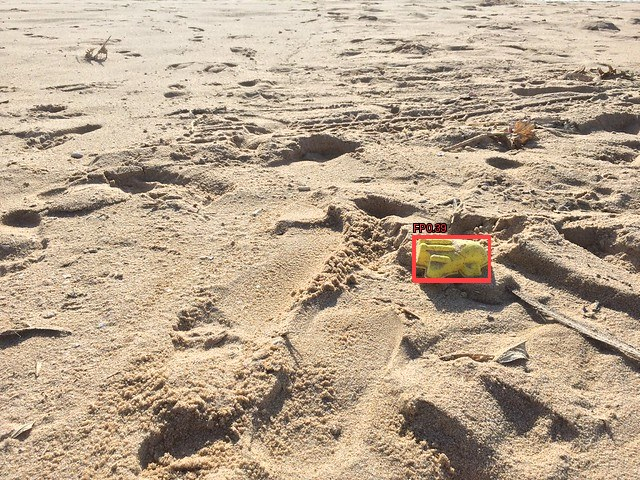
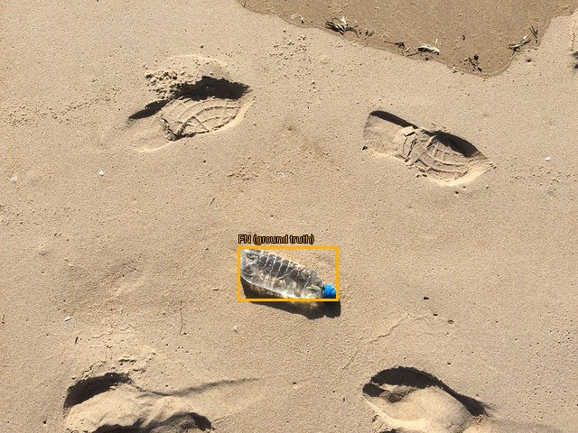
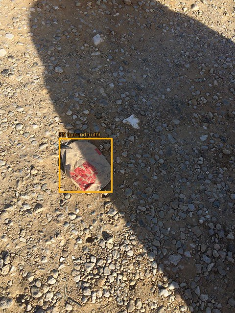

# Оценка: test

Устройство: NVIDIA GeForce GTX 1650; imgsz=640; batch=1; FP32.

| Модель | Precision¹ | Recall¹ | mAP50 | mAP50–95 | Порог | F1² | Среднее, мс | p95, мс |
|---|---:|---:|---:|---:|---:|---:|---:|---:|
| taco_n_types_finetune_50 | 0.4590 | 0.4604 | 0.4592 | 0.3552 | 0.35 | 0.4860 | 21.01 | 25.33 |

¹ Precision/Recall Ultralytics при её внутренней оптимальной точке кривой. AP считается с conf=0.001.
² Рабочий порог выбирается только на validation по максимальному micro F1 при IoU=0.5; при равенстве — Precision, затем больший порог.

Время: одинаковый conf=0.25 для всех моделей; копирование RGB, preprocessing, inference, NMS и перенос рамок на CPU после прогрева; без чтения файла, рисования и загрузки весов. GPU синхронизирован.

## Рабочая точка

| Модель | TP | FP | FN | Precision | Recall |
|---|---:|---:|---:|---:|---:|
| taco_n_types_finetune_50 | 26 | 29 | 26 | 0.4727 | 0.5000 |

## Метрики по классам: taco_n_types_finetune_50

| Класс | Precision¹ | Recall¹ | mAP50 | mAP50–95 | Рабочий F1 | TP | FP | FN |
|---|---:|---:|---:|---:|---:|---:|---:|---:|
| bottle | 0.4559 | 0.5714 | 0.4955 | 0.3623 | 0.5306 | 13 | 15 | 8 |
| bag | 0.3071 | 0.3750 | 0.3791 | 0.3224 | 0.3333 | 3 | 7 | 5 |
| can | 0.6140 | 0.4348 | 0.5031 | 0.3809 | 0.5000 | 10 | 7 | 13 |

## Примеры ошибок

Зелёный — TP, красный — FP, жёлтый — FN (рамка разметки). Один кадр может содержать несколько видов ошибок.

### taco_n_types_finetune_50

## Ограничения

Один seed. Независимость локаций не подтверждена. Качество на море, побережье или спутниковых снимках отдельно не проверено.
- COCO-listed images without annotations are treated as negatives; annotation completeness must be verified.
- Exact RGB duplicates are removed; near-duplicates require verified flight/scene groups.
- Actual split ratios can differ from 70/20/10 because complete groups are kept together.
- Group isolation is only as reliable as the supplied group metadata; verify flight/location boundaries.
- UNVERIFIED FILENAME GROUPS: series grouping is not confirmed flight/location separation; scores are preliminary.
- Only frame 0 of multi-frame images is exported; annotations must describe that frame.
- Only bottle, bag and can are target objects; other litter is not classified by this model.
- Background images can contain non-target litter; they are not necessarily clean.
- Source batches are separated, but independent locations/photographers are not verified.
- Available Flickr 640px derivatives are used with explicit coordinate scaling; originals are a fallback.
- EXIF display orientation is applied as in the official TACO loader; normalized RGB PNGs have longest side <=640px.
- TACO includes ground-level outdoor images; this experiment does not validate drone, marine or satellite generalization.

Модель и порог взяты из зафиксированного решения validation; на test настройки не подбирались.
