# Оценка: val

Устройство: NVIDIA GeForce GTX 1650; imgsz=640; batch=1; FP32.

| Модель | Precision¹ | Recall¹ | mAP50 | mAP50–95 | Порог | F1² | Среднее, мс | p95, мс |
|---|---:|---:|---:|---:|---:|---:|---:|---:|
| taco_n_types_30 | 0.5057 | 0.3541 | 0.3645 | 0.2617 | 0.40 | 0.4687 | 16.38 | 17.56 |
| taco_n_types_finetune_50 | 0.4672 | 0.3687 | 0.3909 | 0.2888 | 0.35 | 0.4893 | 23.56 | 25.05 |
| taco_n_types_finetune_careful_30 | 0.5579 | 0.3511 | 0.3790 | 0.2861 | 0.40 | 0.4853 | 19.91 | 21.90 |

¹ Precision/Recall Ultralytics при её внутренней оптимальной точке кривой. AP считается с conf=0.001.
² Рабочий порог выбирается только на validation по максимальному micro F1 при IoU=0.5; при равенстве — Precision, затем больший порог.

Время: одинаковый conf=0.25 для всех моделей; копирование RGB, preprocessing, inference, NMS и перенос рамок на CPU после прогрева; без чтения файла, рисования и загрузки весов. GPU синхронизирован.

## Рабочая точка

| Модель | TP | FP | FN | Precision | Recall |
|---|---:|---:|---:|---:|---:|
| taco_n_types_30 | 101 | 67 | 162 | 0.6012 | 0.3840 |
| taco_n_types_finetune_50 | 114 | 89 | 149 | 0.5616 | 0.4335 |
| taco_n_types_finetune_careful_30 | 107 | 71 | 156 | 0.6011 | 0.4068 |

## Метрики по классам: taco_n_types_30

| Класс | Precision¹ | Recall¹ | mAP50 | mAP50–95 | Рабочий F1 | TP | FP | FN |
|---|---:|---:|---:|---:|---:|---:|---:|---:|
| bottle | 0.5620 | 0.4823 | 0.5042 | 0.3716 | 0.5296 | 67 | 45 | 74 |
| bag | 0.3181 | 0.2692 | 0.1977 | 0.1239 | 0.3182 | 7 | 11 | 19 |
| can | 0.6370 | 0.3108 | 0.3916 | 0.2895 | 0.4030 | 27 | 11 | 69 |

## Метрики по классам: taco_n_types_finetune_50

| Класс | Precision¹ | Recall¹ | mAP50 | mAP50–95 | Рабочий F1 | TP | FP | FN |
|---|---:|---:|---:|---:|---:|---:|---:|---:|
| bottle | 0.5492 | 0.5184 | 0.5042 | 0.3883 | 0.5373 | 72 | 55 | 69 |
| bag | 0.2258 | 0.2022 | 0.2183 | 0.1426 | 0.2128 | 5 | 16 | 21 |
| can | 0.6268 | 0.3854 | 0.4502 | 0.3355 | 0.4901 | 37 | 18 | 59 |

## Метрики по классам: taco_n_types_finetune_careful_30

| Класс | Precision¹ | Recall¹ | mAP50 | mAP50–95 | Рабочий F1 | TP | FP | FN |
|---|---:|---:|---:|---:|---:|---:|---:|---:|
| bottle | 0.6175 | 0.4752 | 0.5121 | 0.3858 | 0.5354 | 68 | 45 | 73 |
| bag | 0.3939 | 0.2308 | 0.2305 | 0.1632 | 0.2927 | 6 | 9 | 20 |
| can | 0.6623 | 0.3474 | 0.3943 | 0.3093 | 0.4521 | 33 | 17 | 63 |

## Примеры ошибок

Зелёный — TP, красный — FP, жёлтый — FN (рамка разметки). Один кадр может содержать несколько видов ошибок.

### taco_n_types_30

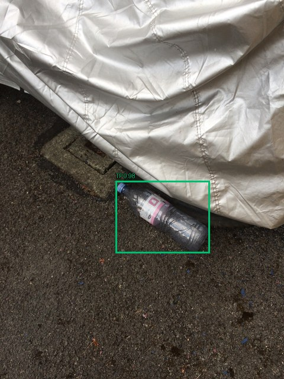

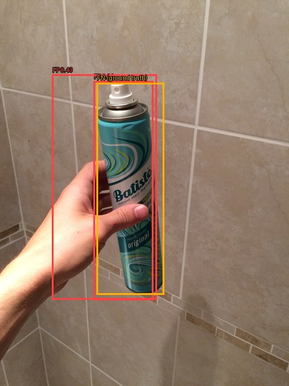

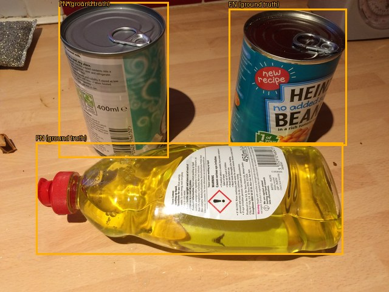

### taco_n_types_finetune_50

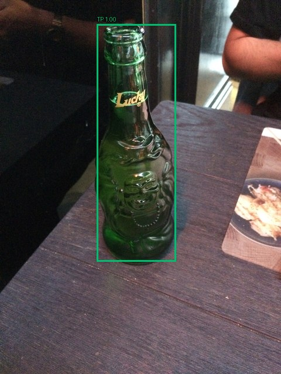

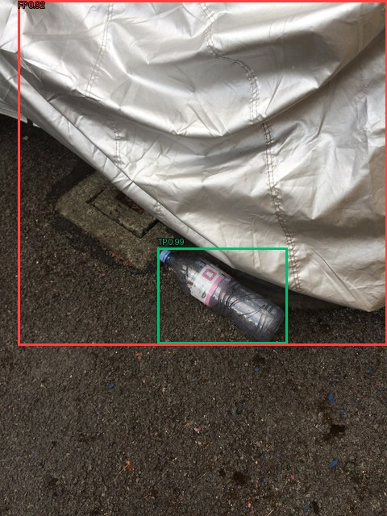

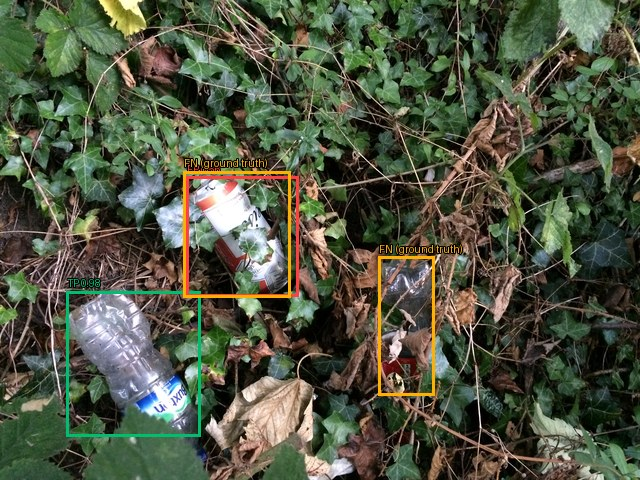

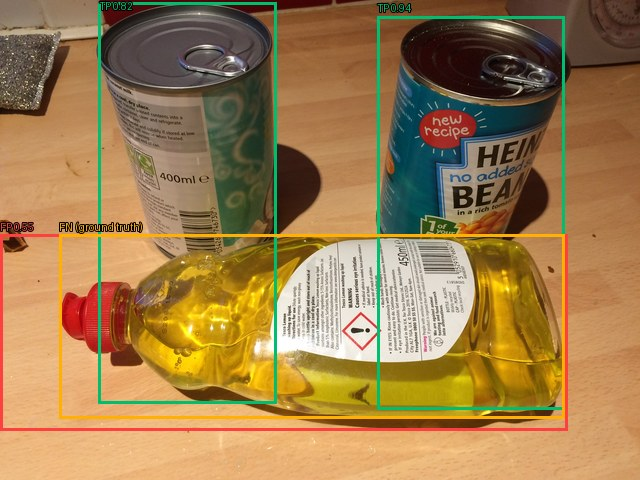

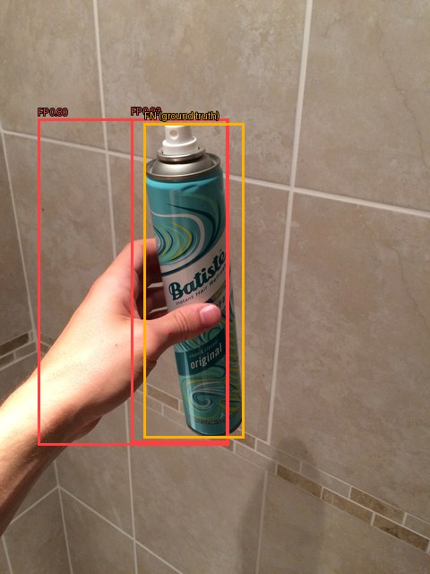

### taco_n_types_finetune_careful_30

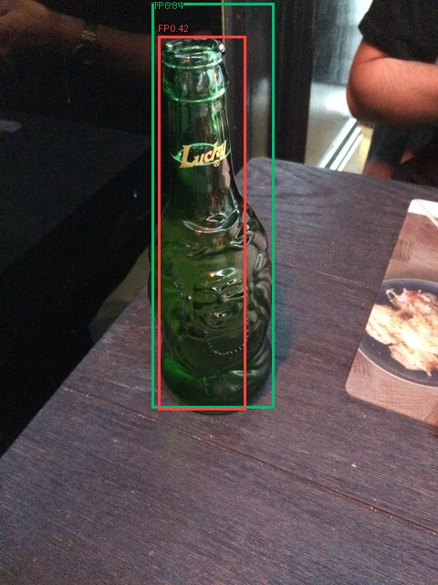

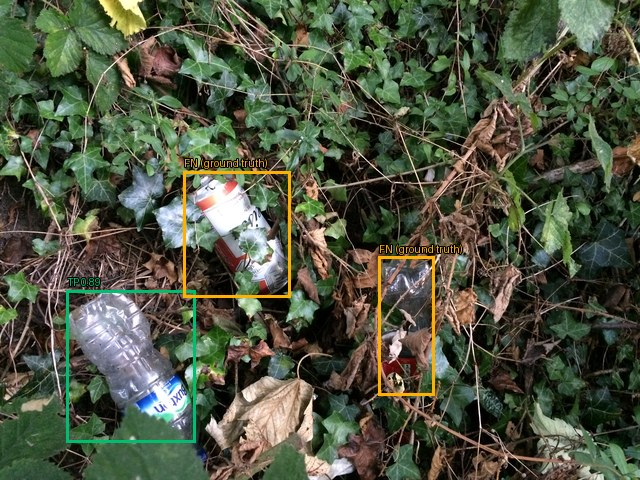

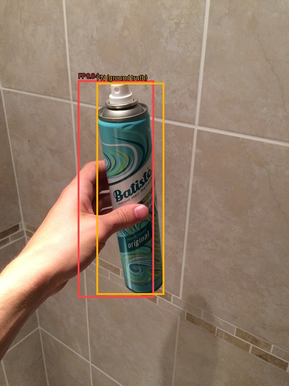

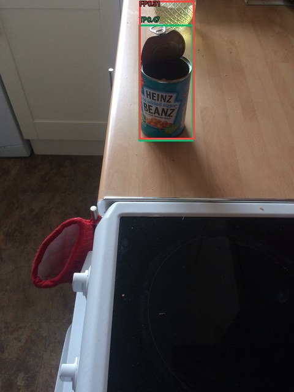

## Ограничения

Один seed. Независимость локаций не подтверждена. Качество на море, побережье или спутниковых снимках отдельно не проверено.
- COCO-listed images without annotations are treated as negatives; annotation completeness must be verified.
- Exact RGB duplicates are removed; near-duplicates require verified flight/scene groups.
- Actual split ratios can differ from 70/20/10 because complete groups are kept together.
- Group isolation is only as reliable as the supplied group metadata; verify flight/location boundaries.
- UNVERIFIED FILENAME GROUPS: series grouping is not confirmed flight/location separation; scores are preliminary.
- Only frame 0 of multi-frame images is exported; annotations must describe that frame.
- Only bottle, bag and can are target objects; other litter is not classified by this model.
- Background images can contain non-target litter; they are not necessarily clean.
- Source batches are separated, but independent locations/photographers are not verified.
- Available Flickr 640px derivatives are used with explicit coordinate scaling; originals are a fallback.
- EXIF display orientation is applied as in the official TACO loader; normalized RGB PNGs have longest side <=640px.
- TACO includes ground-level outdoor images; this experiment does not validate drone, marine or satellite generalization.

Выбрана **taco_n_types_finetune_50** по максимальному validation mAP50–95. Настройки зафиксированы в `selection.json`. Test в этом запуске не использовался.
