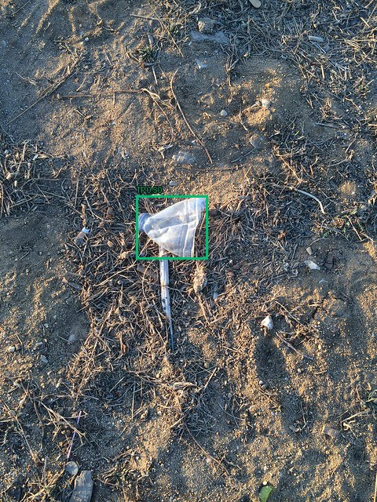
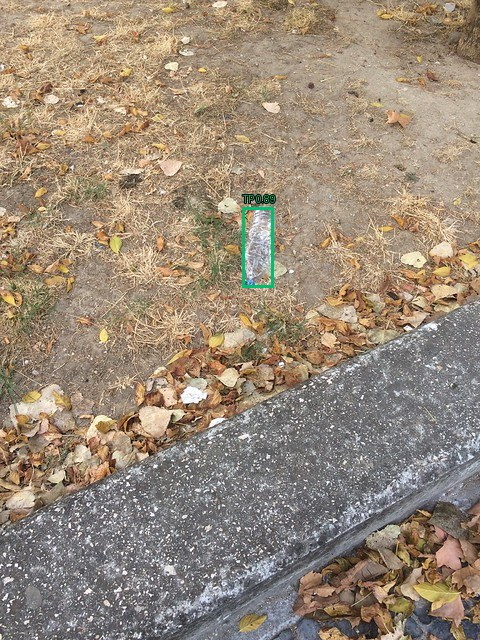
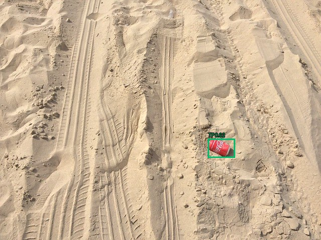
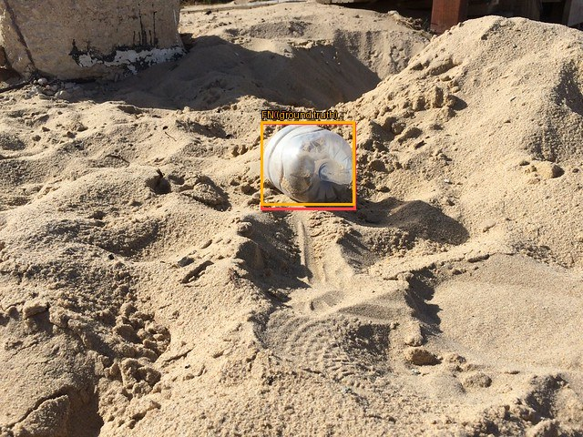
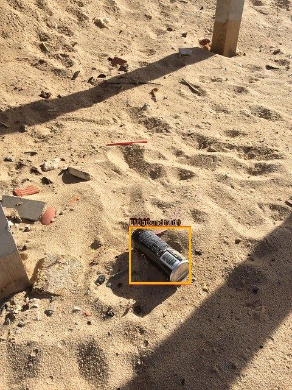
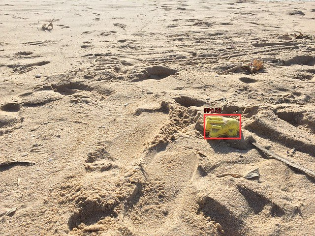
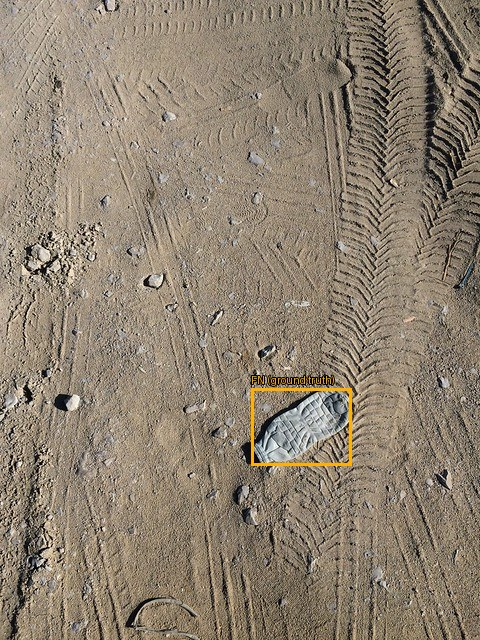

# Оценка: test

Устройство: NVIDIA GeForce GTX 1650; imgsz=640; batch=1; FP32.

| Модель | Precision¹ | Recall¹ | mAP50 | mAP50–95 | Порог | F1² | Среднее, мс | p95, мс |
|---|---:|---:|---:|---:|---:|---:|---:|---:|
| taco_n_types_30 | 0.5543 | 0.3421 | 0.4337 | 0.3311 | 0.40 | 0.4318 | 18.42 | 18.87 |

¹ Precision/Recall Ultralytics при её внутренней оптимальной точке кривой. AP считается с conf=0.001.
² Рабочий порог выбирается только на validation по максимальному micro F1 при IoU=0.5; при равенстве — Precision, затем больший порог.

Время: одинаковый conf=0.25 для всех моделей; копирование RGB, preprocessing, inference, NMS и перенос рамок на CPU после прогрева; без чтения файла, рисования и загрузки весов. GPU синхронизирован.

## Рабочая точка

| Модель | TP | FP | FN | Precision | Recall |
|---|---:|---:|---:|---:|---:|
| taco_n_types_30 | 19 | 17 | 33 | 0.5278 | 0.3654 |

## Метрики по классам: taco_n_types_30

| Класс | Precision¹ | Recall¹ | mAP50 | mAP50–95 | Рабочий F1 | TP | FP | FN |
|---|---:|---:|---:|---:|---:|---:|---:|---:|
| bottle | 0.5078 | 0.4286 | 0.4936 | 0.3517 | 0.4737 | 9 | 8 | 12 |
| bag | 0.3680 | 0.2500 | 0.3470 | 0.3141 | 0.2857 | 2 | 4 | 6 |
| can | 0.7872 | 0.3478 | 0.4604 | 0.3275 | 0.4444 | 8 | 5 | 15 |

## Примеры ошибок

Зелёный — TP, красный — FP, жёлтый — FN (рамка разметки). Один кадр может содержать несколько видов ошибок.

### taco_n_types_30

## Ограничения

Один seed. Независимость локаций не подтверждена. Качество на море, побережье или спутниковых снимках отдельно не проверено.
- COCO-listed images without annotations are treated as negatives; annotation completeness must be verified.
- Exact RGB duplicates are removed; near-duplicates require verified flight/scene groups.
- Actual split ratios can differ from 70/20/10 because complete groups are kept together.
- Group isolation is only as reliable as the supplied group metadata; verify flight/location boundaries.
- UNVERIFIED FILENAME GROUPS: series grouping is not confirmed flight/location separation; scores are preliminary.
- Only frame 0 of multi-frame images is exported; annotations must describe that frame.
- Only bottle, bag and can are target objects; other litter is not classified by this model.
- Background images can contain non-target litter; they are not necessarily clean.
- Source batches are separated, but independent locations/photographers are not verified.
- Available Flickr 640px derivatives are used with explicit coordinate scaling; originals are a fallback.
- EXIF display orientation is applied as in the official TACO loader; normalized RGB PNGs have longest side <=640px.
- TACO includes ground-level outdoor images; this experiment does not validate drone, marine or satellite generalization.

Модель и порог взяты из зафиксированного решения validation; на test настройки не подбирались.
